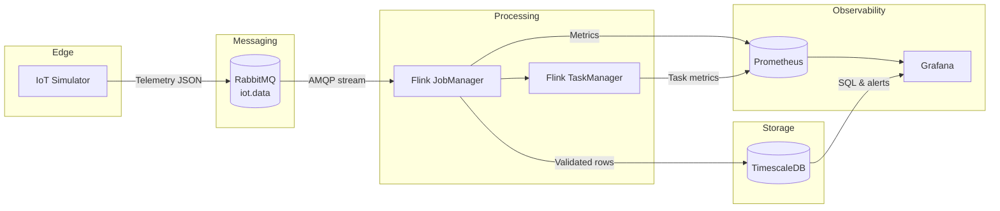
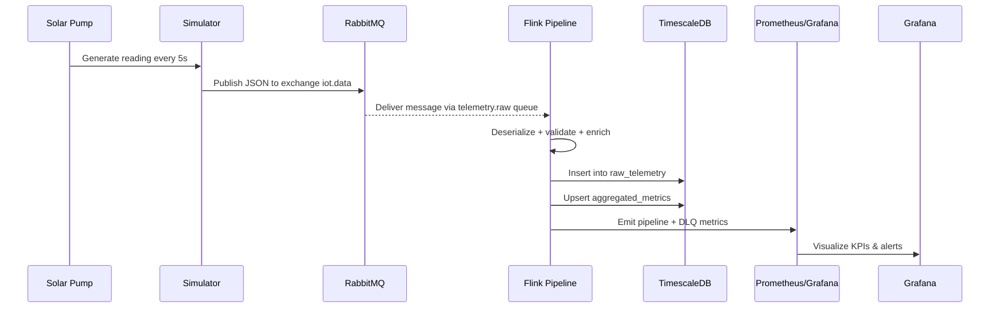

# Solar Pumps IoT Data Pipeline – Architecture

This document explains how the simulator, streaming job, storage, and observability stack fit together. See `docs/diagrams/system_overview.png` and `docs/diagrams/data_flow.png` for printable PNG exports of the Mermaid diagrams below.

## Component Overview

- **IoT Simulator (Python 3.11)** – Generates realistic telemetry for every configured pump, including optional probabilistic failure injection.
- **RabbitMQ + AMQP 0-9-1** – Durable exchange/queue (`iot.data` → `telemetry.raw`) that buffers telemetry bursts and isolates producers from consumers.
- **Apache Flink (JobManager + TaskManager)** – Consumes RabbitMQ messages, validates and enriches telemetry, writes clean data to TimescaleDB, and emits Prometheus metrics.
- **TimescaleDB (PostgreSQL 15)** – Stores raw sensor readings, windowed aggregates, and DLQ records inside hypertables optimized for time-series queries.
- **Prometheus + Exporters** – Scrapes Flink, RabbitMQ, TimescaleDB, and the simulator to expose system health and throughput KPIs.
- **Grafana** – Presents operational dashboards (pump performance, backlog health, alert panels) backed by TimescaleDB + Prometheus datasources.
- **RabbitMQ & Postgres Exporters** – Translate service-specific metrics into Prometheus-friendly endpoints so Grafana can overlay infra health with business KPIs.

## System Diagram

PNG export: `docs/diagrams/system_overview.png`

## Data Flow

PNG export: `docs/diagrams/data_flow.png`

## Technology Choices & Rationale

| Layer | Technology | Why it fits |
| --- | --- | --- |
| Simulator | Python + Pydantic | Fast iteration, rich ecosystem for telemetry modelling, easy fault injection hooks. |
| Messaging | RabbitMQ | Native support for publish/subscribe, per-queue durability, and mature management UI for demos. |
| Stream Processing | Apache Flink 1.18 | Stateful event-time windows, exactly-once sinks, and first-class connectors for RabbitMQ + JDBC. |
| Storage | TimescaleDB | SQL-native time-series features (hypertables, compression, continuous aggregates) and compatibility with Grafana. |
| Metrics | Prometheus + Exporters | Uniform scraping model for containerized services, plus ready-made dashboards in Grafana. |
| Visualization | Grafana | Provisioned dashboards, alerting, and unified view across SQL + Prom metrics. |

## Operational Notes

- **Scaling simulators** – Increase pump definitions or run additional simulator containers; RabbitMQ decouples producers from Flink back-pressure.
- **Flink jar lifecycle** – `make flink-build` produces a shaded jar in `flink-jobs/telemetry-processor/target`. Mounting `./target` into the JobManager keeps redeployments quick.
- **Resilience** – All core services restart automatically (`restart: unless-stopped`). DLQ streams (`dlq_records` table + Grafana panels) highlight validation failures.
- **Security** – `.env` controls credentials for RabbitMQ, TimescaleDB, and Grafana. Rotate them before leaving the demo environment running.
